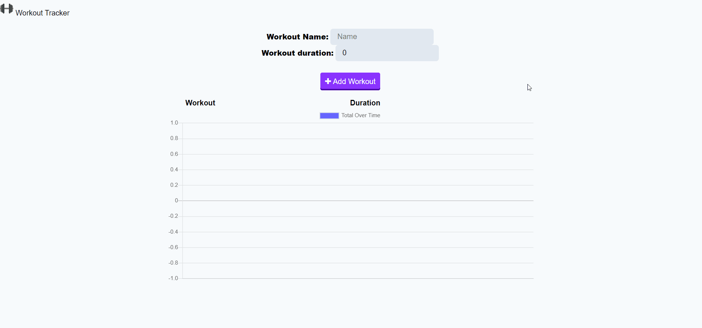

# Workout-Tracker

## Description
The user will be able to add and create workouts which are created with a Mongo database and a Mongoose schema that handles the routes with Express.

## Table of Contents
* [Installation](#installation)
* [Technologies-Libraries](#technologies-libraries)
* [Demo](#demo)
* [Credits](#credits)

## Installation
In your terminal type: 
```git clone https://github.com/verlitas/Workout-Tracker.git```
* Open in Visual Studio to build and run.
* For further instructions, visit https://help.github.com

## Technologies-Libraries
### Code
Morgan - Mongoose - Express - Mongo - JavaScript - HTML - CSS - Bootstrap

## Demo


Live Link: https://verlitas-workouttracker.herokuapp.com/

## Credits
[UABootCamp](https://bootcamp.ce.arizona.edu/coding/)
